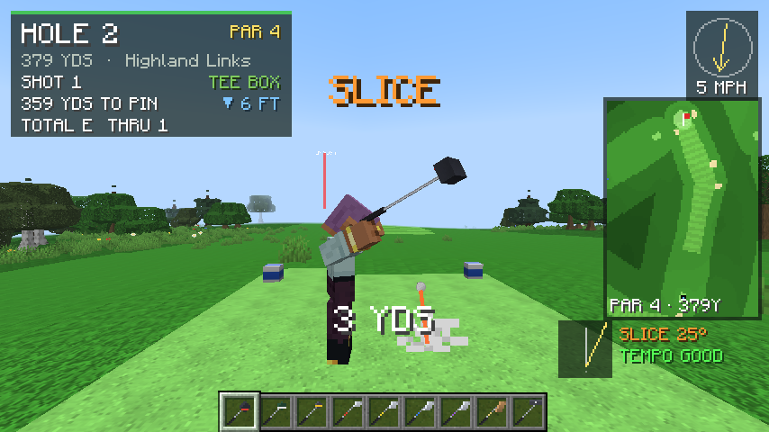
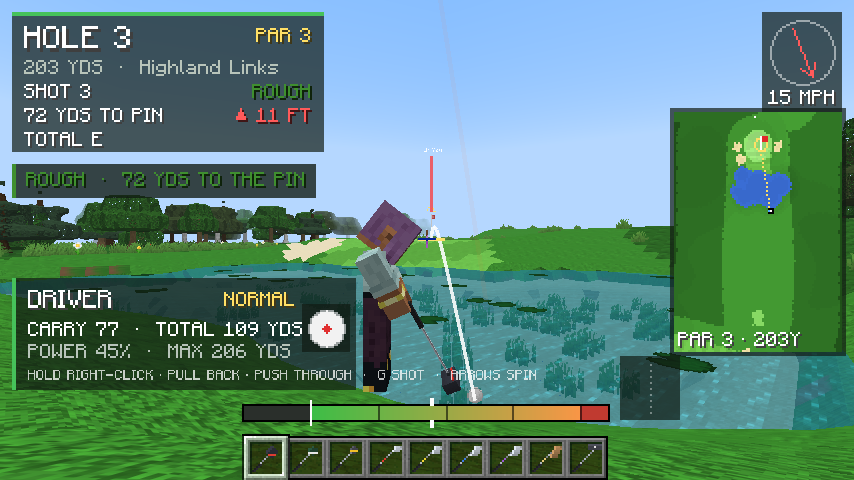
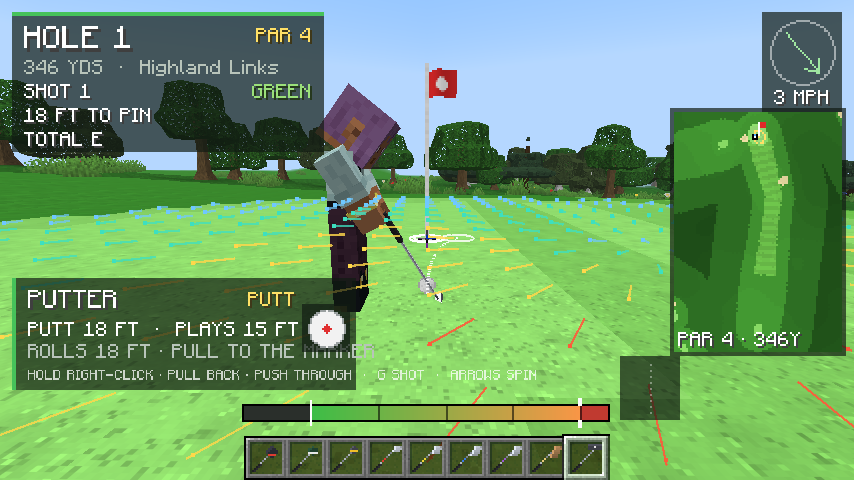
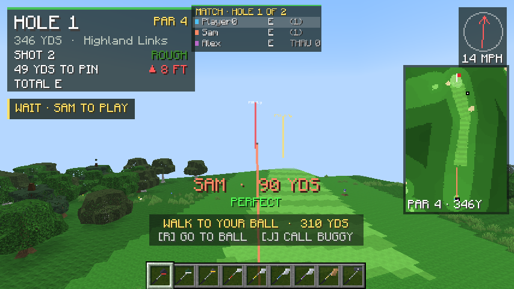
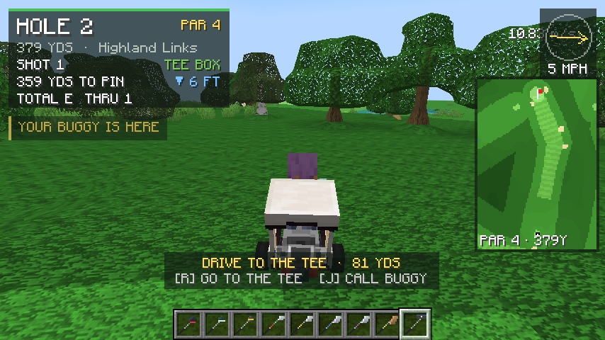

# Golf Tour

PGA-style golf for **Minecraft Java 26.3 (Fabric)**: an 18-hole championship course in its own dimension, a 14-club bag on your hotbar, broadcast cameras, a PGA 2K-style mouse swing, free roam with a golf buggy, real ball flight, wind, lies, sloped greens, water, sound and a full scorecard.

| Smooth terrain (NoCubes) | Putting | Matches with friends | Golf buggy |
|---|---|---|---|
|  |  |  |  |

## Install

**Easiest: the CurseForge modpack.** Download `GolfTour-Modpack-<version>.zip` from the [latest release](https://github.com/Jolly004/golf-tour/releases/latest), then in the CurseForge app: *Create Custom Profile → Import* → choose the zip. The app downloads Fabric, Fabric API, Sodium, Iris and the Complementary Reimagined shaders, and Golf Tour, the NoCubes 26.3 port and the Automobility 26.3 port (golf buggy) come inside the pack. Shaders are switched on already.

**Modrinth app / Prism Launcher:** import `GolfTour-<version>.mrpack` from the same release.

**Manual:** install Fabric Loader 0.19.5+ for 26.3, then put `golftour-0.4.0.jar`, `nocubes-port-0.5.2-port.1+26.3.jar` (smooth terrain) and `automobility-0.5.0-unofficial.36+26.3-fabric.jar` (golf buggy), both in `libs/` and on the release page, plus Fabric API 0.161.0+26.3 in `mods/`. Iris + Sodium + a shader pack are optional but recommended.

Then open any world and type `/golf play`.

## How to play

| Control | Action |
|---|---|
| Mouse | Aim. The landing ring follows your crosshair; past the club's reach it sits at full carry |
| Hotbar / scroll / 1-9 | Choose a club (5W, 6i, 8i, GW and LW sit in your inventory, so swap them in as you like) |
| Right-click near your ball | Step up and address it (WASD steps away) |
| Hold right-click, pull the mouse back, push it through | Swing: how far back = power; a straight stroke = a straight shot, through to the right slices, to the left hooks; tempo counts |
| Left-click | Cancel a swing; click to skip the hole flyover |
| G | Shot type: Normal, Power, Punch, Chip, Flop |
| ← / → | Shape the ball: draw / fade |
| ↑ / ↓ | Strike: topspin / extra backspin |
| Z | Reset spin and shape |
| R | Go to your ball (or the next tee) instead of walking |
| J | Call your golf buggy (Automobility) |
| C | Camera: broadcast (behind the golfer through the whole swing) / first person |
| B | Ball camera on/off |
| V | Green reading grid on/off |
| H (hold) | Scorecard |

The swing works like PGA 2K's swing stick, with the mouse. Hold right-click, pull the mouse back towards you (how far sets the power; the white marker on the meter is the power for your target), then push it forward through the ball. Straight back and through hits it straight; drifting right on the way through pushes or slices, left pulls or hooks (a crooked takeaway counts half). A dawdling downswing loses distance and a snatched one exaggerates a miss. Pulling past 100% overswings: more distance, less forgiveness. Let go of right-click before impact to cancel. After each swing the box by the meter shows your path and tempo.

**Aiming and putting:** stepping up to the ball lines you up on the flag, and the caddie hands you a club (the driver on par-4 and par-5 tees, the putter on the green). The mouse turns your line. The crosshair sets the length along it: how far you want to carry the ball, or how far you want a putt to roll. On the green the camera sits right behind the ball, so the crosshair is on your line. Pull the swing back to the white marker and the putt rolls to the crosshair, slope included (the panel says when a putt plays longer uphill or shorter downhill). The preview line shows the break, so aim off the hole until it finishes in the cup.

Between shots you walk (or drive the buggy) to your ball and then to the next tee, where the hole flyover plays. Press R to skip the walk.

## Commands

- `/golf play [hole]`: start a round (your inventory, game mode and position are saved and given back when you quit).
- `/golf quit`: leave the course.
- `/golf scorecard`: print the card in chat.
- `/golf unplayable`: replay from your last spot with a one-stroke penalty.
- `/golf flyover on|off`: the pre-hole flyover.
- `/golf course`: hole-by-hole yardages.
- `/golf hit <club> <power> [accuracy]` (operators): test swing.

## What's in it

- **The course:** *Highland Links*, par 72, about 6,650 yards. It's generated from a seed with doglegs, striped fairways, sloped greens, deep curved bunkers, ponds, creeks and lakes with hazard stakes, yardage posts, tree-lined corridors and OB stakes. The terrain is smooth: with the bundled NoCubes port the course renders and collides as real curved terrain (sloped greens, bowl-shaped bunkers, rounded banks and trees). Turf is stored in sixteen heights, and NoCubes puts its smooth surface at exactly that height, so the ball rolls on what you see. Without NoCubes the turf heights still give a stepped-but-gentle course.
- **Physics:** drag, Magnus lift, spin decay and wind. Bounces depend on the surface, the slope and backspin (wedges check up and spin back). Putts break along the real slope. Balls go through leaves and bounce off trunks. Penalties for water, out of bounds and lost balls follow the rules.
- **Broadcast presentation:** a hole flyover, a down-the-line camera that stays behind the golfer through the whole swing (animated golfer, 3D clubs), a ball chase camera, a shot tracer, a hole map, a wind compass, and swing results (PERFECT, HOOK and so on). Scores show as Birdie, Eagle and so on, with confetti.
- **Sound:** every effect is synthesised for the mod. Each club type has its own impact sound, plus swing whooshes, landings on each surface, tree hits, splashes, the cup rattle, crowd applause, cheers and groans, and course ambience with birdsong.

## Development

- `./gradlew build` builds the mod and runs the unit tests (ball physics, slopes and course routing).
- `./gradlew runClientGameTest` runs the in-game end-to-end test (it plays a hole and takes screenshots into `build/run/clientGameTest/screenshots`).
- Add `-Pshaders` to either `runClient` or `runClientGameTest` to test with Sodium + Iris + Complementary (put the pack in `tools/shaderpacks/`).
- The art and sound are generated in code: `python tools/gen_assets.py`, then `python tools/gen_clubs.py` (run gen_assets first, because gen_clubs overwrites the club item definitions), and `python tools/gen_sounds.py`.
- `python tools/make_modpack.py` rebuilds the CurseForge pack from `build/libs`.

Built with Claude Code. No game files, decompiled code or third-party art or sound is included.

## Playing with friends

Matches are stroke play for up to four players: one ball each, same holes and same wind, played in real golf order. On the tee the honour goes first (join order on the first hole, then the best score on the last hole); after that whoever is farthest from the hole plays. Everyone holes out before the group moves to the next tee. The lowest total wins.

1. Everyone installs the same modpack.
2. The host opens their world to friends. Press Esc, then **Open to LAN**. The pack includes **e4mc**, so this also gives you an internet address (it's posted in chat) that friends paste into *Multiplayer → Direct Connection*. Anyone on the same Wi-Fi can just use the LAN list.
3. The host types `/golf match create`. Everyone else gets a clickable **[JOIN]** in chat (or types `/golf match join <host name>`).
4. The host clicks **[START 18]** or **[START 9]**, or types `/golf match start <holes>`.

While you play, a leaderboard at the top shows everyone's score and an arrow on whoever's up, and "YOUR SHOT" flashes when it's your turn. Friends' balls get beacons in their colour. When you're standing still, the camera follows their shots, with a tracer and distance. Hold **H** for the group scorecard. `/golf match leave` drops out. If someone disconnects, the rest play on, and they're put back in on the current hole when they reconnect.

## Credits
- Smooth terrain: [NoCubes](https://github.com/Cadiboo/NoCubes) by Cadiboo (LGPL-3.0), ported to Minecraft 26.3 Fabric for this project. The port's source is at https://github.com/Jolly004/nocubes-port (and inside the modpack under `nocubes-source/`). Port changes: 26.3 rendering and API updates, Sodium 0.9 support, and a small `NoCubes.addLayeredSmoothable` API so partial-height blocks smooth at their real height.
